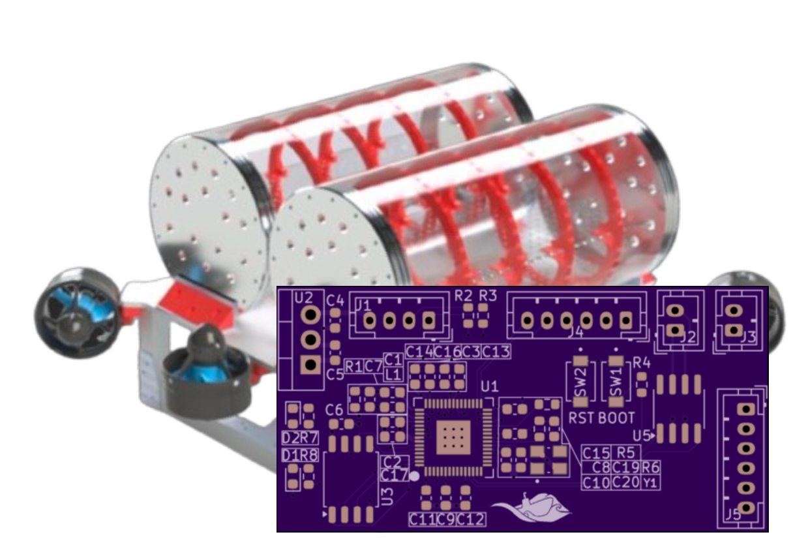

    

<h1 align="center">Guppy Embedded!</h1>

    

Home to the embedded PCB code that runs Guppy: [Palouse RoboSub](https://robosub.eecs.wsu.edu/)'s 2026 AUV for the international RoboSub competition. This code runs on the [custom circuit boards](https://github.com/PalouseRobosub/RP2350PCB) we designed and assembled in-house!

Currently, the CAN base code comes from [KevinOConnor/can2040](https://github.com/KevinOConnor/can2040).

> [!CAUTION]
> Active work in progress! The code is unfinished and untested.

## Setup
Ensure you have a RP Pico SDK environment set up.

## Organization
Work in progress...

## Contributing
Work in progress...

## Contact and Sponsorship
Need to get in touch? Reach out to `robosub.vcea@wsu.edu`.

We are sponsored by many generous companies and people, including:
- OSH Park PCBs
- Blue Robotics
- Real Digital
- Solidworks
- Vectornav
- JoeScan
- WaterLinked
- LattePanda
- Tektronix
- And many many other personal supporters through their generous donations!

Do you like our work? Consider [sponsoring](https://foundation.wsu.edu/give/?fund=ffdf2195-2497-4361-b697-44e5024bf0b0) our team!
