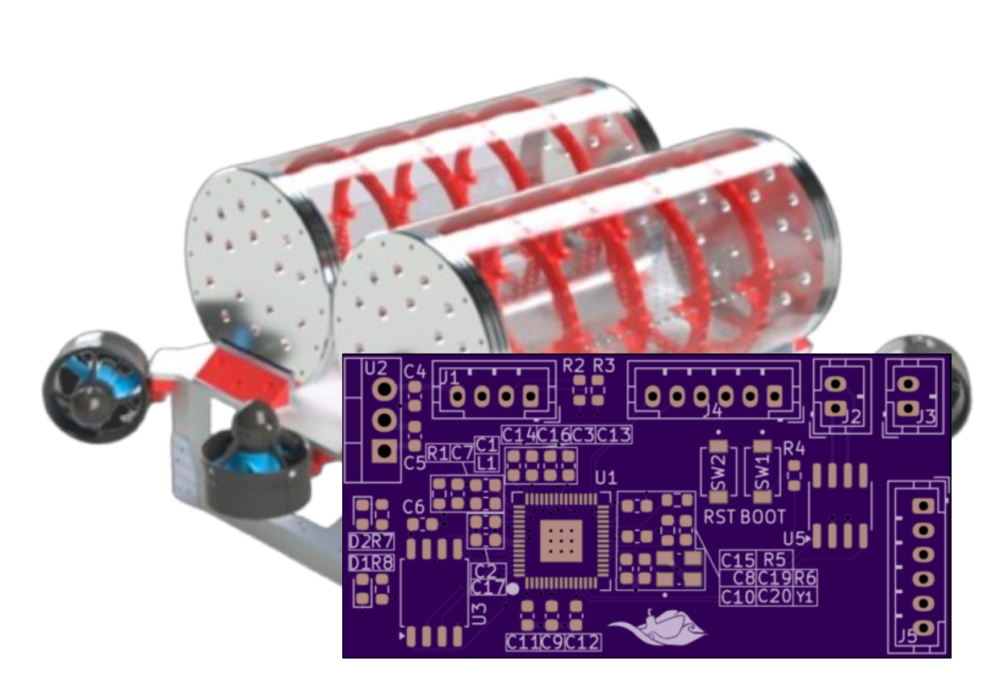

<p align="center">
    
</p>
<h1 align="center">Guppy Embedded!</h1>
<p align="center">
    
</p>

Home to the embedded PCB code that runs Guppy: [Palouse RoboSub](https://robosub.eecs.wsu.edu/)'s 2026 AUV for the international RoboSub competition. This code runs on the [custom circuit boards](https://github.com/PalouseRobosub/RP2350PCB) we designed and assembled in-house!

Currently, the CAN base code comes from [KevinOConnor/can2040](https://github.com/KevinOConnor/can2040).

## Setup

To acquire the necessary build dependencies you can use the Dev Container or Nix.

### Using the Dev Container:
1. Install an IDE which supports Dev Containers (VSCode, CLion, etc.)
2. Install `picotool` from your package manager or [the repository](https://github.com/raspberrypi/picotool)
3. Build and reopen the project within the Dev Container. (IDE specific)

### Using Nix:
1. [Install Nix](https://nixos.org/download)
2. Run `nix-shell` to enter an environment with dependencies and `picotool` installed

### Building:
1. Make and enter a build dir: `mkdir build` and `cd build`
2. Generate build files: `cmake ..`
3. Compile: `make`

### Flashing:
To start, plug in the board to your computer.
#### Manual (finicky)
1. Put the microcontroller into bootsel mode by holding down the RST and BOOT buttons
2. It should then connect to your computer as a storage device
3. Move `board_[board-name].uf2` onto the storage
#### Using `picotool`

```sh
picotool load -f board_[board-name].uf2
```
You may have to manually put the microcontroller into bootsel mode if it's being uncooperative.

## Organization
 
- `/lib`: Libraries (`led` and `guppy_lib` are bespoke)
- `/src/modules`: Board-specific code
- `/src/main.cpp`: Entrypoint

## Contributing

### To contribute code:

1. Make a new branch with the format `name/feature_name` such as `adrian/add_status_led` and make all changes in that branch.
2. Make a Pull Request to the `main` branch and request `@guppyadrian` as a reviewer.
3. Make sure all commits have proper messages starting with `feat:`, `chore:`, or `fix:`
4. Document and comment all of your code!
5. Ensure your code works before merging into main!

## Contact and Sponsorship

Need to get in touch? Reach out to `robosub.vcea@wsu.edu`.

We are sponsored by many generous companies and people, including:

- OSH Park PCBs
- Blue Robotics
- Real Digital
- Solidworks
- Vectornav
- JoeScan
- WaterLinked
- LattePanda
- Tektronix
- And many many other personal supporters through their generous donations!

Do you like our work? Consider [sponsoring](https://foundation.wsu.edu/give/?fund=ffdf2195-2497-4361-b697-44e5024bf0b0) our team!
